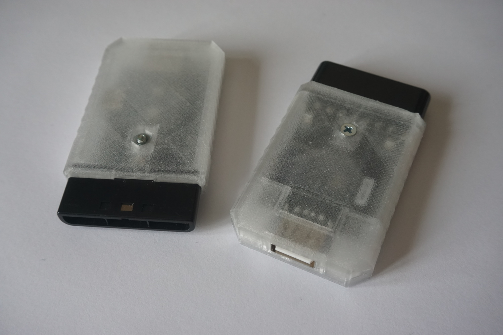

# usb-to-ps1-mouse-pro

This is an adapter for connecting USB mouse to PS1. It emulates the original [SCPH-1090 PlayStation Mouse](https://en.wikipedia.org/wiki/PlayStation_Mouse).

## Availability

[Check here](https://www.franticware.com/usb-to-ps1-mouse-pro-availability) whether the adapter is available for purchase.

## Firmware

The firmware is written mostly in C. It depends on [Raspberry Pi Pico SDK](https://github.com/raspberrypi/pico-sdk).

## Hardware

Go to `kicad` subdirectory for schematics and PCB design files or check `wiring` subdirectory for laymen-friendly picture guide or if you are looking to rewire your older [usb-to-playstation-mouse](https://github.com/Franticware/usb-to-playstation-mouse) adapter.

## Enclosure

Printing in clear PETG is recommended.

3D model: https://www.printables.com/model/914178-official-enclosure-for-usb-to-ps1-mouse-pro

## References - GitHub

This project would not be possible without these. Please go give them a star.

https://github.com/sekigon-gonnoc/Pico-PIO-USB

https://github.com/listff/hidparser

## Support this project

To help this project, you can go listen to or even buy a [music track of mine](https://share.amuse.io/track/vojtech-salajka-color-graphics-pinball-original-game-soundtrack) via your favorite service. It is not much, but it is the only digital product I am currently offering commercially as of writing this. Thank you!
