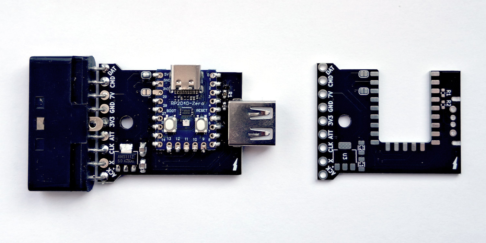
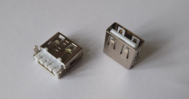
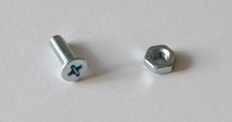

## BOM

|Reference|Value|Datasheet|Footprint|Qty||
|-|-|-|-|-|-|
|C1, C2|10u/16V|~|Capacitor_SMD:C_1206_3216Metric|2||
|J1|Conn_01x09_Pin|~|PS1:Controller_THT90|1||
|J2|USB_A| ~|usb2ps1mouse-specific:USB_A_Sunken|1||
|J3|Conn_01x02|~|Jumper:SolderJumper-2_P1.3mm_Open_RoundedPad1.0x1.5mm|1|Short|
|J4|Conn_01x02|~|Jumper:SolderJumper-2_P1.3mm_Open_RoundedPad1.0x1.5mm|1|Do not short|
|R1, R2|22R|~|Resistor_SMD:R_0603_1608Metric|2||
|U1|RP2040-Zero||RP2040_Board:RP2040-Zero|1||
|U3|AMS1117-5.0|http://www.advanced-monolithic.com/pdf/ds1117.pdf|Package_TO_SOT_SMD:SOT-223-3_TabPin2|1||
||M3x10 countersunk screw + M3 nut|||1+1||

## Manufacturing

I have had the boards made at https://jlcpcb.com using the following parameters:

- PCB Thickness: 1.6
- PCB Color: Black
- Silkscreen: White
- Material Type: FR4
- Via Covering: Tented
- Surface Finish: LeadFree HASL
- Outer Copper Weight: 1 oz
- Board Outline Tolerance: ±0.2mm (Regular)
