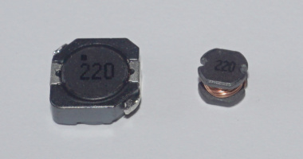

## BOM

|Reference|Value|Datasheet|Footprint|Qty||
|-|-|-|-|-|-|
|C1, C2|10u/16V|~|Capacitor_SMD:C_1206_3216Metric|2||
|D1|SS14|https://www.vishay.com/docs/88746/ss12.pdf|Diode_SMD:D_SMA|1||
|J1|Conn_01x07_Pin|~|PS1:Controller_THT90|1||
|J2, J3|Conn_01x01_Pin|~|usb2ps1mouse-specific:DSCON_pad|2||
|J4|USB_A| ~|usb2ps1mouse-specific:USB_A_Sunken|1||
|L1, L2|22u|~|-- mixed values --|1||
|R1, R2|22R|~|Resistor_SMD:R_0603_1608Metric|2||
|U1|~||RP2040_Board:RP2040-Zero|1||
|U2|ME2108A50PG||Package_TO_SOT_SMD:SOT-89-3|1||
||M3x10 countersunk screw + M3 nut|||1+1||
