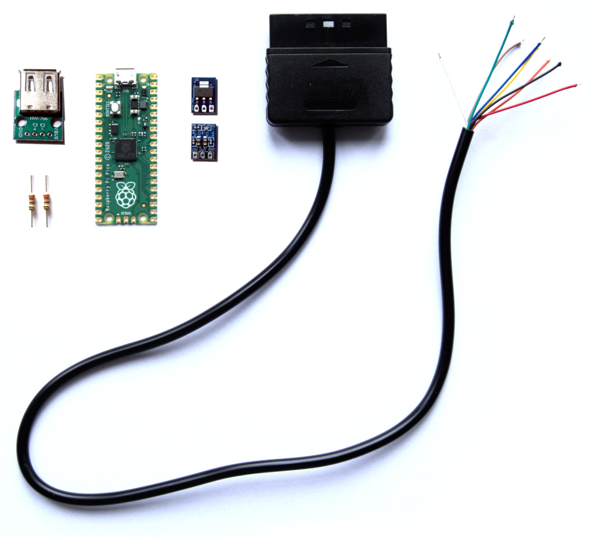

### ⚠️ Notice: This wiring guide is outdated. Please wait until it is up-to-date with board revision PCB_3.

## Handwiring the adapter

Building the PCB variant is recommended, but some may prefer this one. It does not look as good, but works just as well.

Components:

* PlayStation controller cable with connector
* Raspberry Pi Pico (or RP2040-Zero)
* Mini PFM Control DC-DC USB 0.9V-5V to 5V dc Boost Step up Power Module
* 22 Ohm resistor (2 pcs)

The cable has colored wires, but the color coding is not guaranteed and has to be checked with a multimeter in continuity mode. Unused wires have to be isolated.

The components are to be wired as follows:

Or with RP2040-Zero:

Make sure the components and wires do not short anywhere.

Flashing the firmware is done in the usual manner, i.e. the Pi is connected to a PC via a micro USB or USB-C cable while BOOTSEL or BOOT button is pressed. The Pi appears as USB flash drive and **uf2** file is copied to it.
